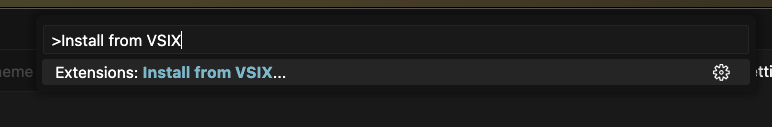
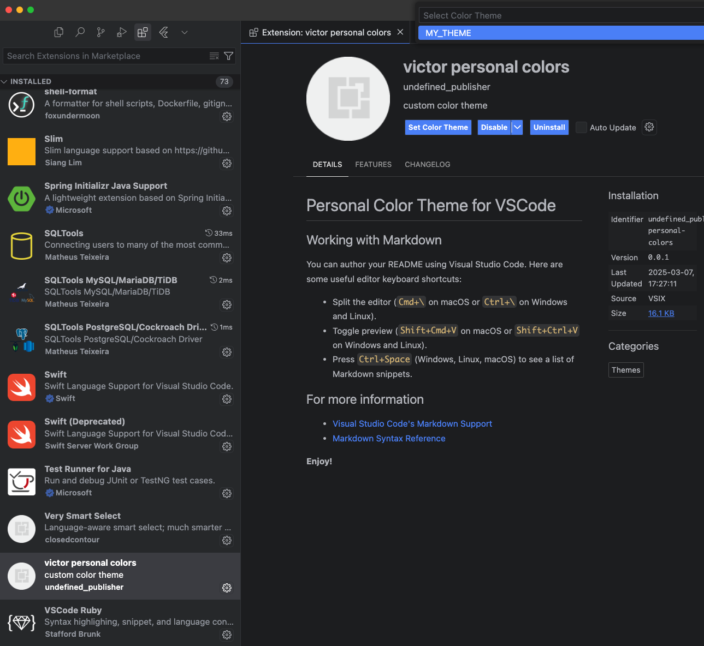

# Personal Color Theme for VSCode

## How to install

1. Download the .vsix file
2. Go to VSCode and use the option `Extensions: Install from VSIX`

3. Select the .vsix file, and install it
4. Go to Settings / Extensions
5. Select the extension and click on "Set Color Theme"
6. Select the "MY THEME OPTION"

